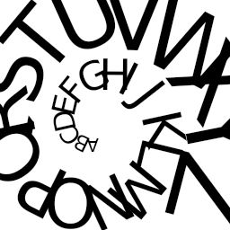
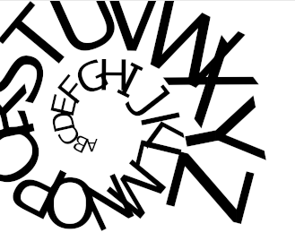

```cpp
void draw(SkCanvas* canvas) {
    const int iterations = 26;
    SkRSXform transforms[iterations];
    char alphabet[iterations];
    SkScalar angle = 0;
    SkScalar scale = 1;
    for (size_t i = 0; i < std::size(transforms); ++i) {
        const SkScalar s = SkScalarSin(angle) * scale;
        const SkScalar c = SkScalarCos(angle) * scale;
        transforms[i] = SkRSXform::Make(-c, -s, -s * 16, c * 16);
        angle += .45f;
        scale += .2f;
        alphabet[i] = 'A' + i;
    }
    SkPaint paint;
    SkFont font(fontMgr->matchFamilyStyle(nullptr, {}), 20);
    auto spiral = SkTextBlob::MakeFromRSXform(alphabet, sizeof(alphabet), transforms, font);
    canvas->drawTextBlob(spiral, 110, 138, paint);
}
```


# Fiddle screenshot


# go-skia screenshot

