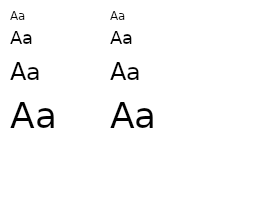
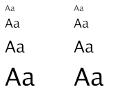

```cpp
void draw(SkCanvas* canvas) {
    SkPaint paint;
    SkFont defaultFont = SkFont(fontMgr->matchFamilyStyle(nullptr, {}));
    float textSizes[] = { 12, 18, 24, 36 };
    for (auto size: textSizes ) {
        defaultFont.setSize(size);
        canvas->drawString("Aa", 10, 20, defaultFont, paint);
        canvas->translate(0, size * 2);
    }
    defaultFont = SkFont(fontMgr->matchFamilyStyle(nullptr, {}));
    float yPos = 20;
    for (auto size: textSizes ) {
        float scale = size / 12.f;
        canvas->resetMatrix();
        canvas->translate(100, 0);
        canvas->scale(scale, scale);
        canvas->drawString("Aa", 10 / scale, yPos / scale, defaultFont, paint);
        yPos += size * 2;
    }
}
```


# Fiddle screenshot


# go-skia screenshot

